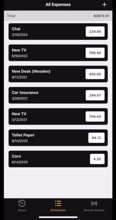

# Personal Expenses + Barcode Scanner

   

## Description

This is a simple React Native project for learning purposes. It is a personal expenses app that allows the user to add new expenses, edit existing ones, and delete them.

It also includes a barcode scanner that allows the user to scan a product's barcode, retrieve its information from an API and add it as an expense to the list.

## Technologies

- React Native
- Expo
- JavaScript
- Expo Camera
- React Navigation
- React Native Vector Icons
